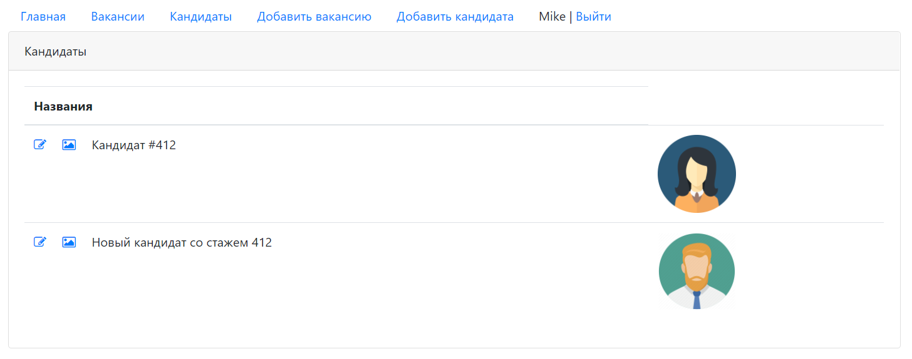

This project demonstrates working with Java Servlets, Java Server Pages (JSP), JSTL, JavaScript, AJAX, HTML, CSS.

This project represents a mini HR supporting application with examples of user authentication and registration, 
making posts and images uploads and browsing them in lists.

  